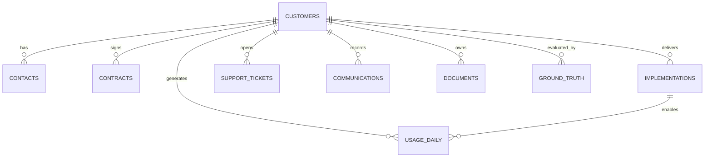

# Entity relationship design

`workspace_id` models an independently configured operating unit. Day 1 uses one workspace per customer; later profiles can vary this. `ground_truth` is intentionally separated from operational tables to prevent target leakage in analytics or AI prompts.

### PostgreSQL access pattern

Start from `customers`, aggregate the last 30/60/90 days of `usage_daily`, open tickets, latest implementation, renewal horizon, and engagement. Preserve raw tables and build derived views/models rather than updating source records.
